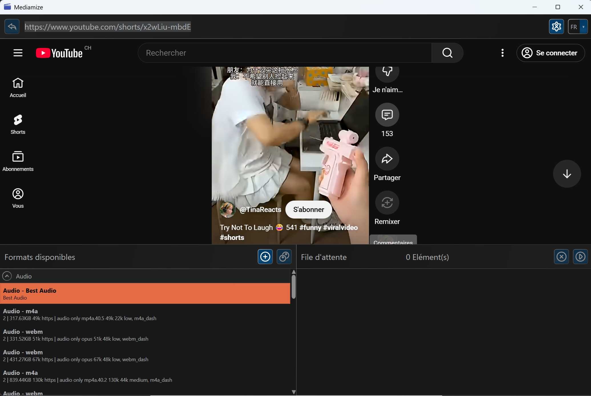

**Mediamize is a youtube download wrapper / Windows desktop application that run yt-dlp.exe commands on youtube or other plateforms.**

You will need : 

Youtube Download exe (yt-dlp.exe) : 
https://github.com/yt-dlp/yt-dlp/releases

Ffmpeg exe (ffmpeg.exe) : 
https://www.gyan.dev/ffmpeg/builds/

Deno exe (deno.exe) :
https://github.com/denoland/deno/releases/

Put theme in a directory and fill the Mediamize config with exe paths.

Enjoy !

THE SOFTWARE IS PROVIDED "AS IS", WITHOUT WARRANTY OF ANY KIND, EXPRESS OR IMPLIED.
IN NO EVENT SHALL THE AUTHORS BE LIABLE FOR ANY CLAIM, DAMAGES OR OTHER LIABILITY.

Copyright (C) 2025 [Votre Nom]

Permission is hereby granted, free of charge, to any person obtaining a copy
of this software for NON-COMMERCIAL USE ONLY, subject to the following conditions:

1. The software may be used, copied, and modified for personal and non-commercial purposes only.
2. Commercial use requires explicit written permission from the copyright holder.
3. The above copyright notice and this permission notice shall be included in all copies.

4. THE SOFTWARE IS PROVIDED "AS IS", WITHOUT WARRANTY OF ANY KIND.

